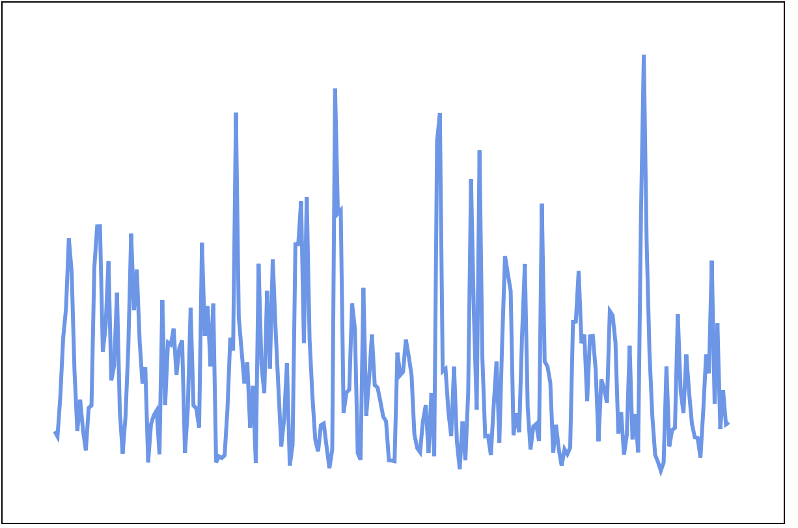
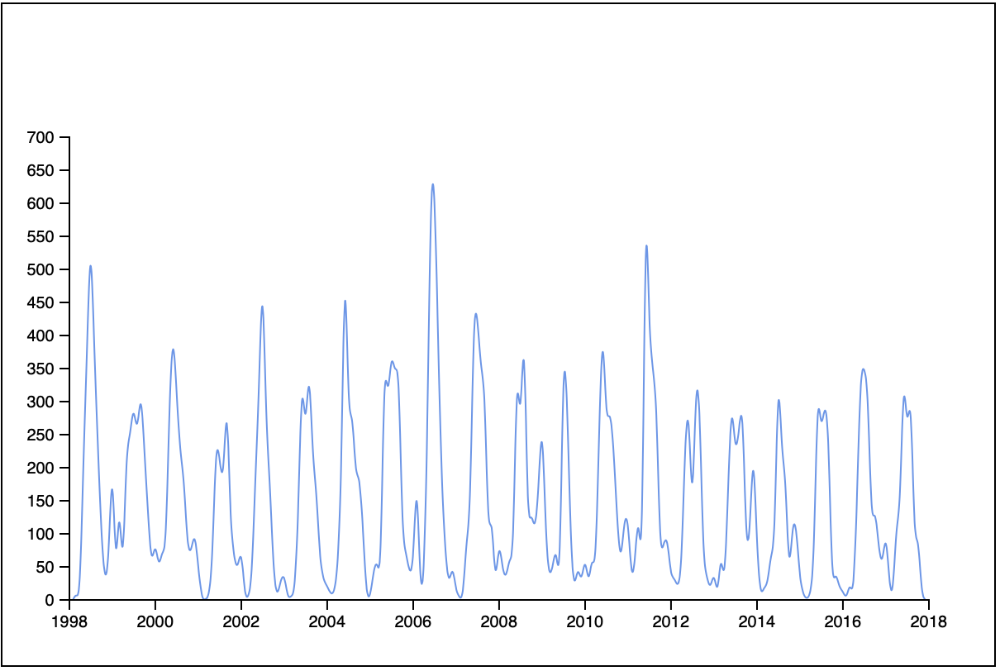

## Drawing an Axis

This next section will continue from the percipitation graph in [07-Paths](../07-Paths).

The current graph is looking good but it would be hard for people to intuit what we were expressing with this image. 

Which asks the question: What is this image expressing?



Time is running left to right on the horizontal axis. What is the time? The graph shows 1998 to 2017. 

A the vertical axis the graph is showing how much rain fell for each month. 

There should be a month for each peak but it's hard to tell where 2005 might be? Or any other month or year. 

The higher peaks show more rain fall but I can't tell how many inches of rain fall that represents?

Some labels on the horizontal and vertical axis of the graph whould help!

What if our graph looked like this: 



An axis is a series of labels that run along the horizontal and vertical axis of the graph. If you're thinking D3 has a tool to generate an axis you would be correct! 

## Setting size and margins

In the last example we set the size by using hard numbers. This works but will create a lot of work for us if we need to change the size of our graph. 

Our SVG viewport is 600 by 400 pixels and moved the graph inside these dimensions by 40 pixels on each side. 


The image above shows the size of the SVG viewport with the dotted line showing the area where the graph/line/path is drawn. 

A better approach is to add some variables for these values.

Add some constants to the top of your code: 

```JS
function handleData(data) {
	const width = 600
	const height = 400
	const margin = 40
	// draw stuff here
	...
```

We will use these numbers later in the code to determine the size and position of the elements we draw. 

## Time Scale

The horizontal axis in the previous example used a linear scale with a range of 40 to 560. D3 provides `d3.scaleTime()` to convert a domain of dates into a range. 

For this to work we need to provide D3 with date objects. Currently our data has dates in string format. 

```
30/11/2016
```

That's `day/month/year`. This must european? Maybe that's why the state codes are weird? 

Luckily D3 has `d3.timeParse()` a function we can use to format a string into a date object. 

Add the following above your scales:

```JS
// Dates are formatted: 30/11/2017
const parseTime = d3.timeParse('%d/%m/%Y')
// parse the dates for d3
baData.forEach(d => d.date = parseTime(d.date))
```

You provide a formatting string when you create your `parseTime` function. The characters `%d` represent the day, `%m` represents the month, and `%y` the year. This matches the situation in our date strings.

The second line loops over all of the objects in our data and replaces the existing date string with a date object. 

Now we can use a time scale for the xscale. Replace the existing xscale with: 

```JS
// Make a time scale for the horizontal axis
const xscale = d3.scaleTime()
	// Get the extents for the date
	.domain(d3.extent(stateData, d => d.date))
	// Range takes into account the width and margin
	.range([0, width - margin * 2])
	.nice() // rounds the scale off and makes it look nicer
```


